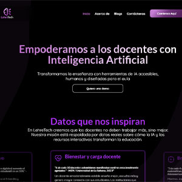
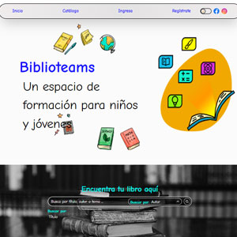

## Hola, Mi nombre es Juan 👋
### Fullstack engineer full cycle

**Desarrollador Full Stack AI-First** con un enfoque integral en la creación de aplicaciones robustas y escalables.
Integro la Inteligencia Artificial en todo el ciclo de vida del producto: desde el diseño de experiencias UX/UI de
alto impacto hasta la arquitectura técnica y la automatización estratégica de pruebas (QA).

Soy un generador de valor que combina rigor técnico con una mentalidad creativa y colaborativa. Me
caracterizo por mi constante auto-formación, creatividad, trabajo en equipo y adaptabilidad

## Stack

  

### QA
  

## Experiencia

### Desarrollador fullstack AI-firtst
#### Sofka U
#### Febrero 2026 - Abril 2026

Fortalecí mi dominio en el **ciclo de vida** del producto mediante una especialización avanzada en **Desarrollo Fullstack** y **QA Automation**. Lo cual me permitió perfeccionar la implementación de arquitecturas escalables y el diseño de estrategias de prueba automatizadas unitarias y en escenarios end-to-end, garantizando la integridad técnica y la calidad del software en entornos de desarrollo dinámicos y de alta exigencia

### Desarrollador web UX/UI Designer
#### Freelance
#### Diciembre 2024 - presente

Lidero el ciclo de vida completo de productos digitales, desde la concepción estratégica y el diseño de experiencia de usuario (UX/UI) hasta el despliegue técnico Fullstack. Implemento metodologías ágiles para gestionar proyectos complejos, garantizando entregas eficientes y productos tecnológicos de alta calidad que alinean los objetivos de negocio con las necesidades del usuario final

## Proyectos

<table style="border-collapse: collapse; border-spacing: 0; border: none; width: 100%; table-layout: fixed;">
  <!-- 1. FILA DE TÍTULOS (Ahora arriba) -->
  <tr align="center">
    <td style="padding: 10px 5px;"><b>Footbal Legends</b></td>
    <td style="padding: 10px 5px;"><b>Lerhetech</b></td>
    <td style="padding: 10px 5px;"><b>Biblioteams</b></td>
  </tr>

  <!-- 2. FILA DE IMÁGENES (Sin espacios) -->
  <tr>
    <td style="padding: 0; border: none;">
      
    </td>
    <td style="padding: 0; border: none;">
      
    </td>
    <td style="padding: 0; border: none;">
      
    </td>
  </tr>

  <!-- 3. FILA DE DESCRIPCIONES -->
  <tr align="center">
    <td valign="top" style="padding: 15px 10px 5px 10px; font-size: 0.85em; line-height: 1.4;">
      Aplicación web de librería con los últimos datos de partidos, jugadores y torneos.
    </td>
    <td valign="top" style="padding: 15px 10px 5px 10px; font-size: 0.85em; line-height: 1.4;">
      Plataforma educativa impulsada por IA para ayudar al docente en sus labores educativas.
    </td>
    <td valign="top" style="padding: 15px 10px 5px 10px; font-size: 0.85em; line-height: 1.4;">
      Proyecto de biblioteca digital para gestionar bibliotecas comunitarias.
    </td>
  </tr>

  <!-- 4. FILA DE LINKS (Accesibilidad y Navegación) -->
  <tr align="center">
    <td style="padding: 10px 5px 20px 5px;">
      <a href="https://futbolegends.com">🌐 Ver Footbal Legends</a>
    </td>
    <td style="padding: 10px 5px 20px 5px;">
      <a href="https://lehretech.com">🌐 Ver Lerhetech</a>
    </td>
    <td style="padding: 10px 5px 20px 5px;">
      <a href="https://biblioteams-2.vercel.app/">🌐 Ver Biblioteams</a>
    </td>
  </tr>
</table>

